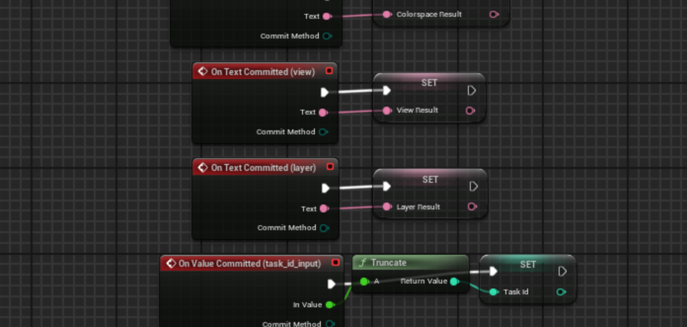

# VFX Pipeline Tools

Selected pipeline tools and case studies developed for VFX and real-time production workflows.

The original production source code is not included. This repository documents the tools, workflows, and technical solutions through screenshots and concise case studies.

## Case studies

### [Unreal EXR Publishing](./unreal-exr-publishing/)

A Nuke-based workflow for preparing Unreal render paths, processing multilayer EXRs, and preparing outputs for publishing. The goal was to reduce render-farm load by publishing dailies from the RGBA channels only while keeping production paths consistent with the broader pipeline.

**Unreal Engine · Nuke · Python · EXR · Deadline**

### [Unreal Persistent Data Assets](./unreal-persistent-data/)

A small Unreal workflow for keeping “sticky” editor-tool values between sessions. The solution stores configuration in a Primary Data Asset as JSON so editor tools can read and update their state without relying on an external config file.

**Unreal Engine · Blueprints · Data Assets · JSON · Editor Tools**

### [Unreal Render Submitter](./unreal-render-submitter/)

A custom Unreal Editor widget for preparing render outputs and publishing the resulting version to the production tracking system.

**Unreal Engine · Blueprints · Python · ShotGrid**

## Repository structure

- [unreal-exr-publishing/](./unreal-exr-publishing/) — EXR processing and publishing workflow
- [unreal-persistent-data/](./unreal-persistent-data/) — standalone persistence case study
- [unreal-render-submitter/](./unreal-render-submitter/) — render preparation and publishing tool

The examples in this repository are documentation-focused portfolio pieces. Production code and project-specific implementation details are intentionally omitted.