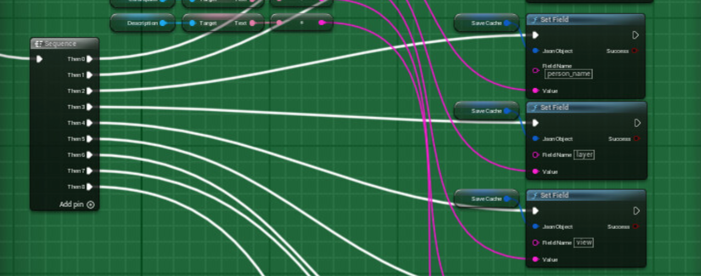
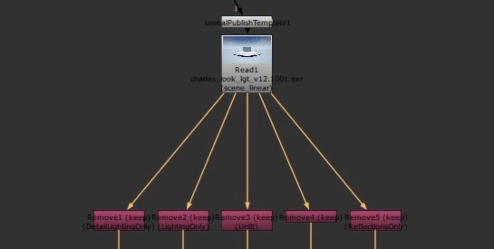
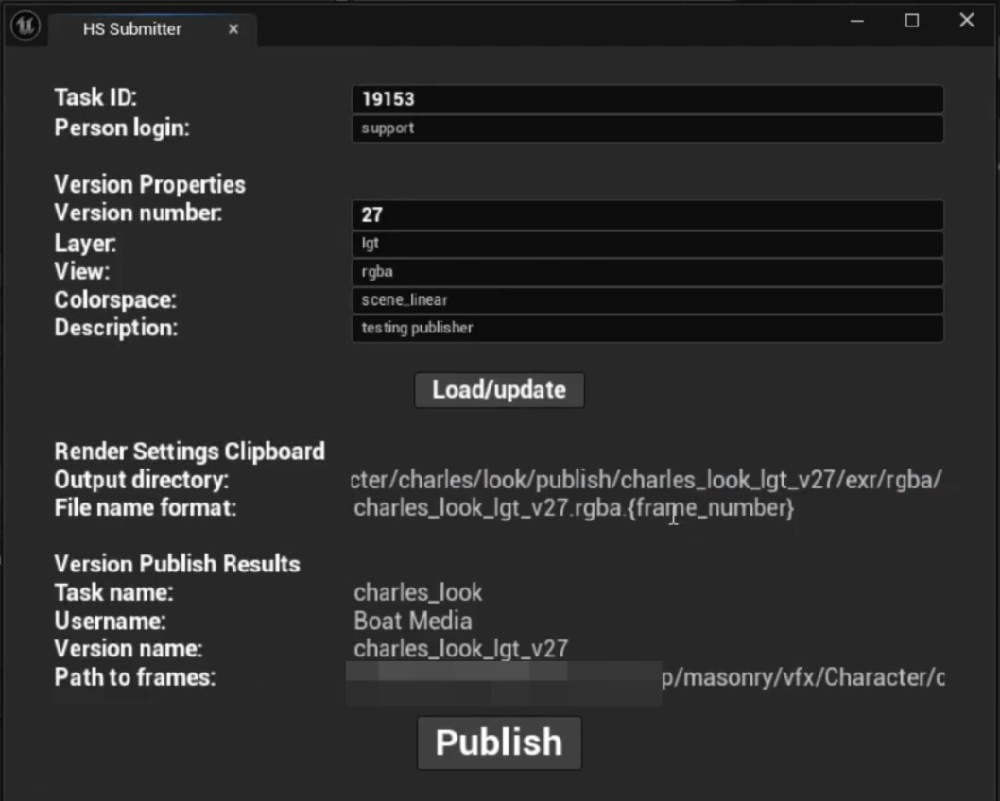

# Pipeline Tools

Selected pipeline tools developed for VFX and real-time production workflows.

The original production source code is not included. This repository documents the tools, workflows, and technical solutions through screenshots and concise case studies.

## Projects

### [Unreal ↔ Nuke Publishing Pipeline](./unreal-nuke-publishing/)

A Nuke-based workflow for preparing Unreal render paths, processing multilayer EXRs, and publishing outputs. The workflow was designed to reduce render-farm load by publishing dailies from RGBA channels only, while keeping render paths consistent with the production pipeline.

**Unreal Engine · Nuke · Python · EXR · Deadline**

### [Unreal Render Submitter](./unreal-render-submitter/)

A custom Unreal Editor widget for preparing render outputs and publishing the resulting version to the production tracking system.

**Unreal Engine · Blueprints · Python · ShotGrid**