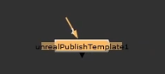
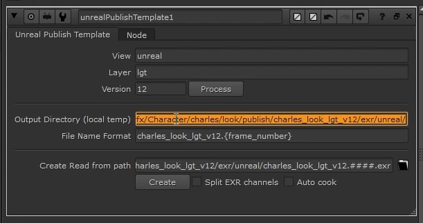
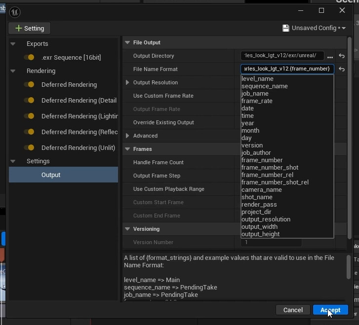
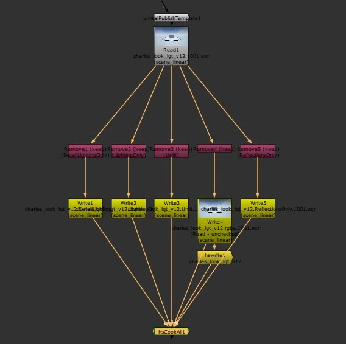

# Unreal EXR Publishing

A Nuke tool for processing multilayer EXRs rendered from Unreal Engine and preparing them for publishing.

The main goal was to reduce render-farm load by publishing dailies from the RGBA channels only, while keeping the output paths consistent with the production pipeline for rendering directly and locally from Unreal Engine.

## Workflow

The tool generates output paths for local rendering based on the current production context and pipeline conventions. These paths can be copied directly into Unreal Engine's render settings.

After rendering, the user returns to Nuke. The tool creates a Read node from the production context and automatically builds the required processing graph.

**Read → Remove → Write → Publish**

The tool isolates individual channels and creates output nodes according to the type of data being processed.

| Channel | Format |
|---|---|
| RGBA | DWAA, 16-bit |
| Position | PIZ, 16-bit |
| Depth | PIZ, 16-bit |
| Normals | PIZ, 16-bit |
| Cryptomatte | ZIP, 32-bit |

For RGBA channels, the workflow creates a custom publishing node based on the Write node, followed by a `cookAll` gizmo that batches the rendering and publishing process.

Write nodes render the individual outputs locally, while the publishing node publishes the RGBA version for dailies.

## Technical focus

- Nuke Python automation
- Multilayer EXR processing
- Automatic node creation
- Channel-specific output rules
- Render farm and publishing workflows

## Demo

https://github.com/user-attachments/assets/fe760048-676a-4f6b-9eb0-6fff6dfdfa68

Production source code is not included.