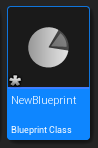
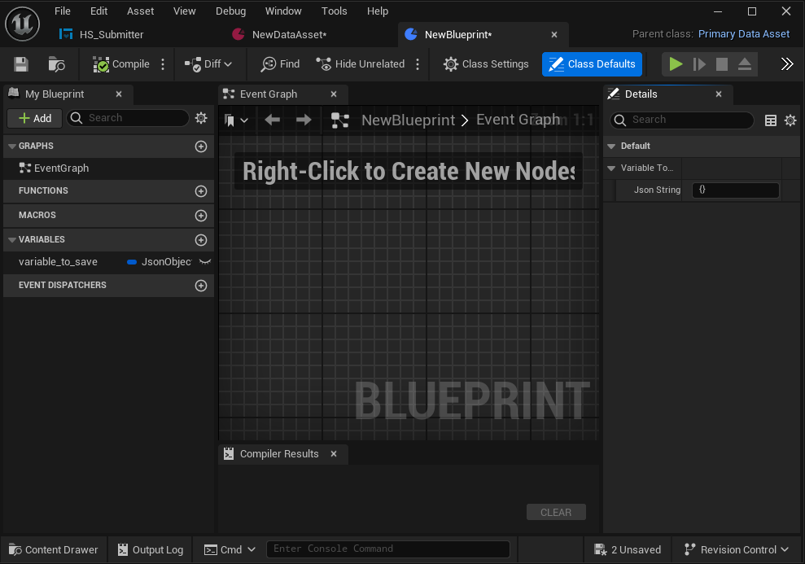
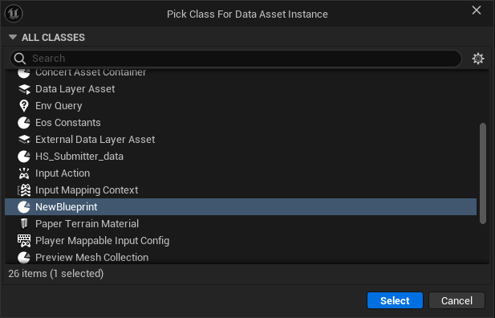
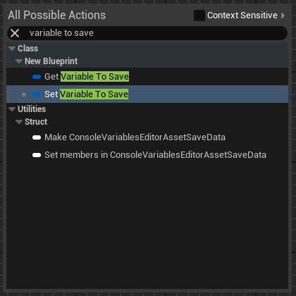
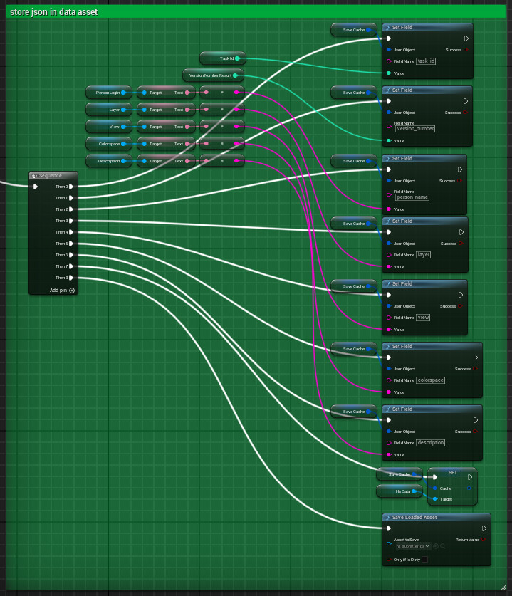
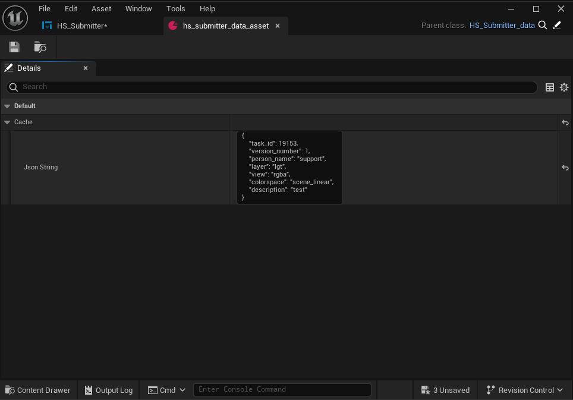
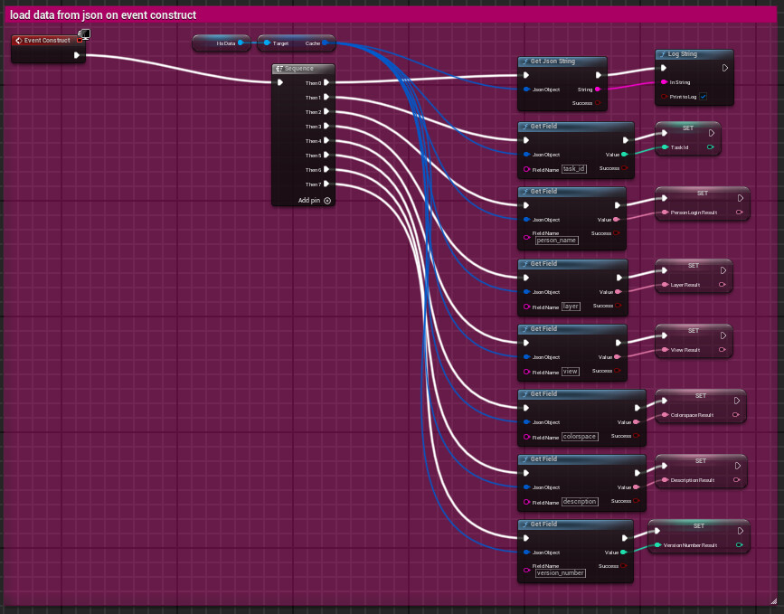
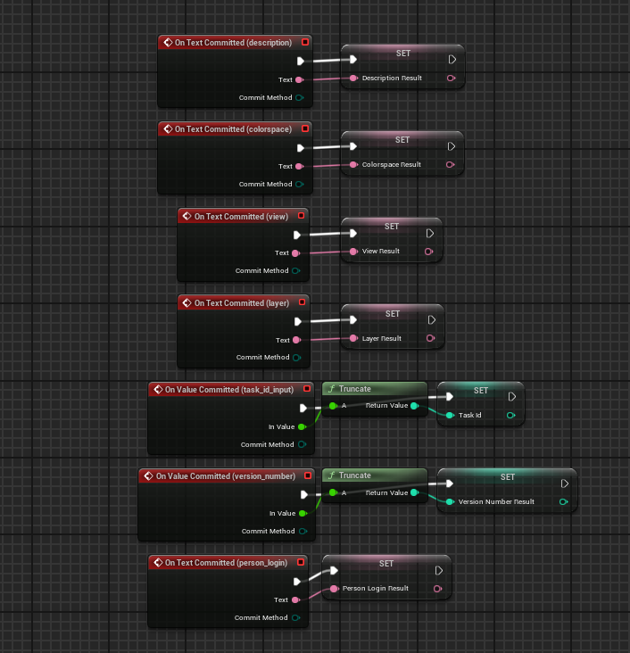

# Persistent Data Assets in Unreal

A workflow for storing variable values in a Blueprint Class, saving them, and loading them again on every new session.

## 1. Create a Primary Data Asset Blueprint Class

You can store variable values in a Blueprint Class, save them, and load them again on every new session. Similar to Python Classes, Blueprint Classes are objects with variables that you can instantiate through another object called a Data Asset, which will be an instance of the class, modified and stored.

From the Content Browser, create a new Blueprint Class:

**All Classes → Primary Data Asset**

This will be the instantiable Blueprint Class.

Open the new Blueprint Class and create the desired variable. In this example, we are adding a JSON string.

Compile and save. You can set a default value or leave it empty.

## 2. Create a Data Asset

Right-click in the Content Browser:

**Miscellaneous → Data Asset**

Select the Primary Data Asset created in the previous step.

This will create an instance of the Blueprint Class.

You can now save and load these variables in any place you want, such as an Editor Utility Widget.

## 3. Possible Scenario

We want to save a JSON string with data and have access to this data from session to session.

We need to update the JSON object, save it, and load it when the project starts.

## 4. Store the JSON in the Data Asset

We want to construct a JSON object variable and then save it in the Data Asset, which is the instance of the Blueprint Class.

In this case, in the Event Graph from an Editor Utility Widget, we are iterating through different keys and values using the `Set Field` node, and always using a local JSON variable called `Save Cache`.

Finally, in the graph editor, we are creating a new variable using the Data Asset object, and with the updated JSON, we are saving this data with a `Save Loaded Asset` node.

You’ll see the updated data in the Data Asset object.

## 5. Load the Data

You can then load it again on every project load with an `EventConstruct` event, get the Data Asset variable, and get the fields from the JSON.

## 6. Update Saved Variables

All variables that are saved in the JSON use the `OnValueCommitted` event.

The individual values can then be updated from the editor interface and stored back in the JSON.

## Technical Focus

- Blueprint Classes
- Primary Data Assets
- Editor Utility Widgets
- JSON
- Asset persistence
- `Set Field`
- `Save Loaded Asset`
- `EventConstruct`
- `OnValueCommitted`

The production implementation is not included.
